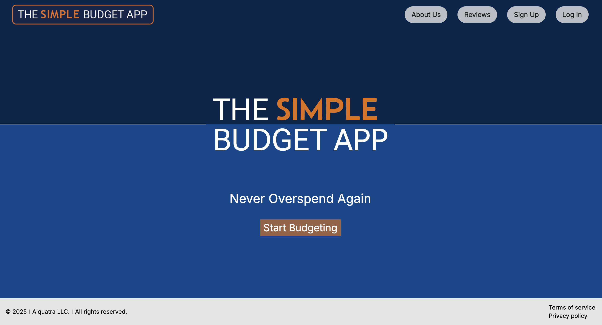
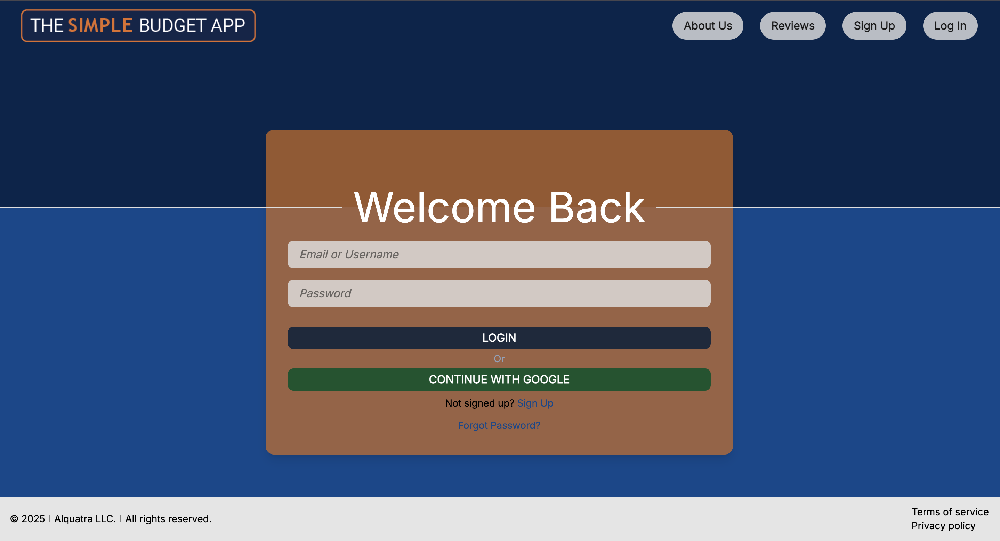
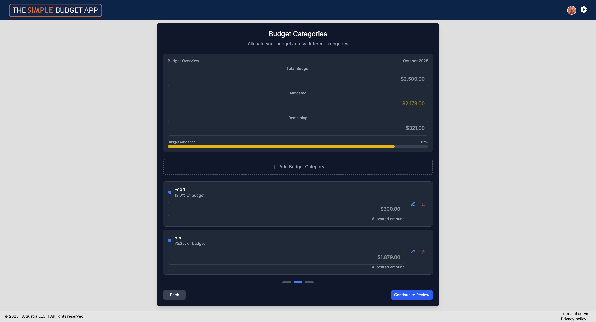
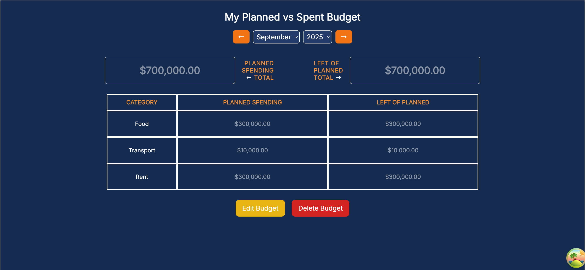

# The Simple Budget App

*The Simple Budget App* is a **modern, full-stack budgeting platform** designed for individuals seeking an *intuitive*, *privacy-focused* way to manage their finances. Built with the **MERN stack** (*MongoDB*, *Express.js*, *React*, *Node.js*) and styled with **Tailwind CSS**, it offers *personalized budgeting*, *category management*, and *real-time spend tracking*. Deployed as a *containerized application* on **Render**, it ensures *scalability*, *security*, and *ease of use*.



---

## ✨ Features

- **Secure Authentication**: *Sign up* and *log in* with *hashed passwords*, *JWT-based sessions*, and *Google OAuth* integration.
- **Multi-Step Budget Creation**: *Intuitive forms* for setting *monthly* or *yearly budgets*, specifying *currencies*, and defining *categories*.
- **Category Management**: *Add*, *edit*, or *delete* budget categories with *validation* to prevent over-allocation.
- **Interactive Budget Table**: View budgets in a *sortable, tabular format* with options to *edit*, *review*, or *delete*.
- **Responsive Design**: A *sleek*, *Tailwind CSS-powered* interface optimized for *desktop* and *mobile* devices.
- **Robust Validation**: *Front-end* and *back-end* checks ensure *data integrity* and a *seamless user experience*.
- **Dockerized Deployment**: *Fully containerized* with a *multi-stage Docker build* for efficient production environments.
- **Upcoming Features**:
  - *Expense Tracking* (*In Progress*): Record expenses per category with *real-time updates* to totals.
  - *Dashboard Visualizations* (*Planned*): Visualize financial progress with *charts* and *category breakdowns*.
  - *Reviews Page* (*Planned*): Analyze spending patterns with *detailed budget reviews*.

---

## 🛠️ Stack & Architecture

- **Monorepo**: Organized with *npm workspaces*, separating `/client` (*React*) and `/server` (*Node.js/Express*).
- **Front End**:
  - *React*: Dynamic, component-based UI.
  - *TanStack Query*: Efficient *API state management* with prefetching to reduce loading delays.
  - *Zustand*: Lightweight *state management* for UI.
  - *Tailwind CSS*: Responsive, modern styling.
- **Back End**:
  - *Node.js & Express.js*: RESTful APIs for seamless data handling.
  - *Mongoose*: MongoDB schema modeling with *compound indexing* for performance.
  - *Middleware*: Custom *authentication*, *validation*, and *error handling*.
- **Database**: *MongoDB* with optimized schemas for *users*, *budgets*, and *expenses*.
- **Containerization**: Multi-stage *Docker* build for *production-ready* deployments.
- **Deployment**: Hosted on *Render* via a *Docker image* pushed to *DockerHub*.

---

## 🚀 Quick Start

### Prerequisites

- *Node.js*: v20 or higher
- *npm*: v9 or higher
- *Docker*: Optional, for containerized deployment
- *MongoDB*: Local or cloud instance (e.g., *MongoDB Atlas*)
- *Git*

### 1. Clone and Install

```bash
git clone https://github.com/juma-paul/the-simple-budget-app.git
cd the-simple-budget-app
npm install
```

### 2. Environment Setup

Copy `server/.env.example` to `server/.env` and configure:

```env
DATABASE_URL=<Your MongoDB connection string>
JWT_SECRET=<Your secure JWT secret>
PORT=6798
```

> **Note**: Ensure *`DATABASE_URL`* connects to a valid *MongoDB* instance and *`JWT_SECRET`* is a strong, unique string.

### 3. Development

Run the *server* and *client* in development mode:

```bash
# Start backend (in one terminal)
npm run dev

# Start frontend (in another terminal)
npm run client
```

- **Client**: Runs on `http://localhost:5173` (or your configured port).
- **Server**: Runs on `http://localhost:6798`.

### 4. Production Build

Build the *client* and start the *server* in production mode:

```bash
npm run build
npm start
```

The *production build* serves the *React app* from `client/dist` and the *API* from the configured port.

### 5. Docker

Build and run the app using *Docker*:

```bash
docker build -t yourdockerhub/the-simple-budget-app .
docker run -e PORT=6798 -e DATABASE_URL=<Your MongoDB URL> -e JWT_SECRET=<Your JWT Secret> -p 6798:6798 yourdockerhub/the-simple-budget-app
```

Push to *DockerHub*:

```bash
docker login
docker push yourdockerhub/the-simple-budget-app
```

The app is deployed on *Render*: [https://the-simple-budget-app.onrender.com](https://the-simple-budget-app.onrender.com).

---

## 📖 Usage

1. **Sign Up / Log In**: Create an account or log in using *email/password* or *Google OAuth*.
2. **Create a Budget**: Use the *multi-step form* to set a budget, select a *currency*, and add *categories*.
3. **Manage Categories**: *Edit* or *delete* categories with *validation* to stay within the planned total.
4. **View Budgets**: Explore budgets in a *sortable table* with *edit* and *delete* options.
5. **Track Expenses** (*Coming Soon*): Log expenses per category with *real-time balance updates*.
6. **Dashboard & Reviews** (*Planned*): Visualize financial data with *charts* and *detailed spending insights*.

---

## 📸 Screenshots

| **Login**                    | **Budget Creation Form**            | **Budget Table View**             |
|:--------------------------------------:|:-----------------------------------:|:---------------------------------:|
|  |  |  |

---

## 💻 Example Code

### Client API Call (`client/api/authApi.js`)

```javascript
export const signupApi = async (formData) => {
  const { username, email, password, acceptedTerms, acceptedPrivacy } = formData;
  return await fetchWithAuth("/api/auth/signup", {
    method: "POST",
    headers: { "Content-Type": "application/json" },
    body: JSON.stringify({
      username,
      email,
      password,
      acceptedTerms,
      acceptedPrivacy,
    }),
  });
};
```

### Server Endpoint (`server/controllers/auth.controller.js`)

```javascript
export const signUp = async (req, res, next) => {
  try {
    const { username, email, password, acceptedTerms, acceptedPrivacy } = req.body;
    if (!username || !email || !password) {
      return next(errorHandler(400, "All fields are required."));
    }
    if (!acceptedTerms || !acceptedPrivacy) {
      return next(errorHandler(400, "You must accept terms and privacy policy."));
    }
    const hashedPassword = await bcrypt.hash(password, 10);
    const newUser = new User({
      username: username.toLowerCase(),
      email: email.toLowerCase(),
      password: hashedPassword,
      acceptedTerms,
      acceptedPrivacy,
    });
    await newUser.save();
    return successResponse(res, 201, "User created successfully.");
  } catch (error) {
    if (error.code === 11000) {
      const duplicateField = Object.keys(error.keyPattern)[0];
      return next(errorHandler(400, `An account with this ${duplicateField} already exists.`));
    }
    return next(errorHandler(500, "Failed to create user."));
  }
};
```

---

## 📂 Project Structure

```
the-simple-budget-app/
├── client/                   # React frontend
│   ├── api/                  # API calls with TanStack Query
│   ├── components/           # Reusable UI components (e.g., Loading, Notification)
│   ├── pages/                # Page components (SignUp, Login, SeeBudget, etc.)
│   ├── store/                # Zustand stores for state management
│   └── dist/                 # Production build output
├── server/                   # Node.js/Express backend
│   ├── controllers/          # Request handlers for API routes
│   ├── models/               # Mongoose schemas (User, Budget, Expense)
│   ├── routes/               # Express route definitions
│   ├── middleware/           # Custom middleware (auth, validation, errors)
│   ├── tasks/                # Background tasks (e.g., deleteExpiredUsers)
│   └── .env                  # Environment variables
├── package.json              # Monorepo configuration with workspaces
├── Dockerfile                # Docker configuration
└── README.md                 # Project documentation
```

---

## 🤝 Contributing

We welcome contributions to enhance *The Simple Budget App*! To contribute:

1. **Fork** the repository.
2. Create a *feature branch*: `git checkout -b feature/your-feature-name`
3. **Commit** your changes: `git commit -m "Add your feature"`
4. **Push** to your fork: `git push origin feature/your-feature-name`
5. Open a *pull request* with a detailed description of your changes.

Please follow the project’s *coding style* and include *tests* where applicable.

---

## 📜 License

This project is licensed under the [*MIT License*](./LICENSE).

---

## 🌐 Demo

Explore the live demo: [https://the-simple-budget-app.onrender.com](https://the-simple-budget-app.onrender.com).


---

> ***The Simple Budget App*** *empowers users to take control of their finances with intuitive, modern tools. Join us in building a better way to budget—contributions and feedback are always welcome!*

